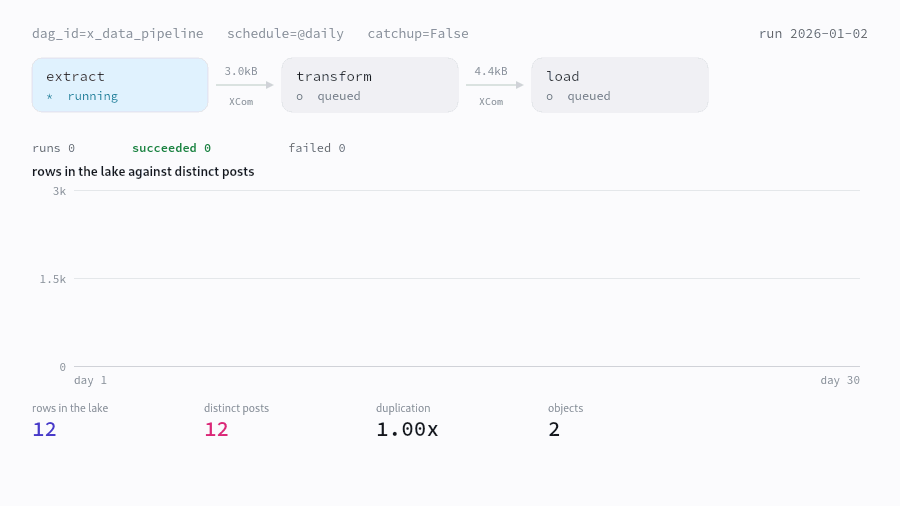
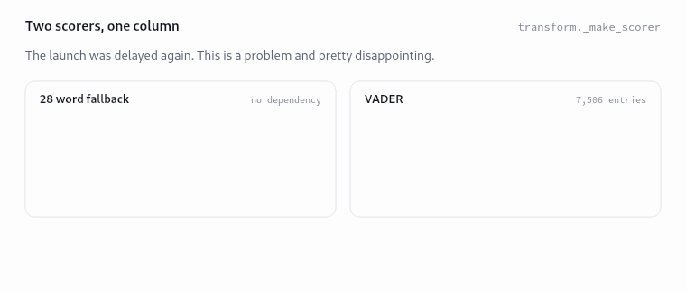
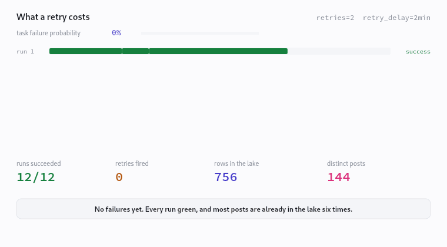
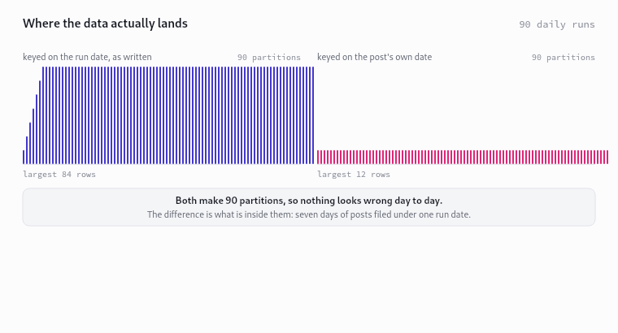
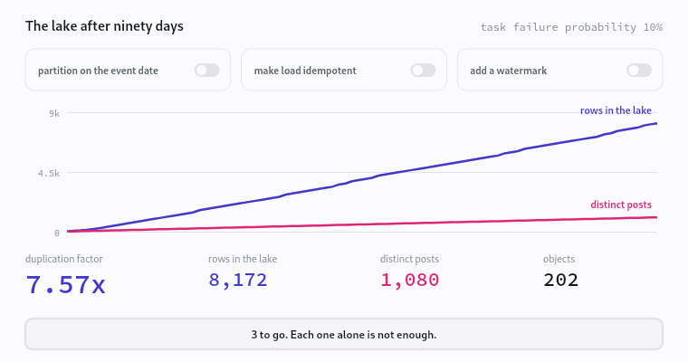

# The DAG is green and the data is wrong

An interactive page that runs this repository's pipeline in the browser and
shows what ninety days of successful runs actually write to the lake.

**Live: https://x-data-pipeline.vercel.app**



| | |
| --- | --- |
|  |  |
|  |  |

## What it is

The subject is orchestration, so the page simulates the platform rather than
describing it. A scheduler ticks, task instances change state, XCom payloads
move between tasks carrying their real sizes, and Parquet objects land in a
partition tree. Every element is a view into that one simulation.

The headline is a contradiction the repository produces on its own: thirty
consecutive runs, thirty successes, nothing to alert on, and roughly seven
copies of every post in the lake.

| Element | What it shows |
| --- | --- |
| Hero | The DAG on its schedule, with the divergence between rows written and distinct posts opening as it runs |
| 1 | The real ETL executed in your browser, on the repo's fixture or your own text |
| 2 | Both of the repo's sentiment scorers on the same text, with the matched and missed tokens |
| 3 | An Airflow simulation with `retries` and `retry_delay`, and what a retry costs in duplicate rows |
| 4 | Run date against event date partitioning, the backfill collapse, and the `day` column collision |
| 5 | Ninety days of the lake, three levers, and the duplication factor that falls out of them |
| 6 | XCom payload growth, Parquet schema drift, silent truncation, and what the four tests can see |

## What it found

Everything below is reproduced by a gate. Nothing is asserted from reading the
code alone.

**The partition key is the run date.** `load._partition_path` formats
`datetime.now(timezone.utc)`, so `year=/month=/day=` describes when the pipeline
ran, not when the post was written. `catchup=False` is the only thing hiding it:
backfill ninety days and the entire archive lands in one partition.

**There are two fields named `day`, and they disagree.** `transform` adds a
string column `day` holding the post's own date. `load` writes into a directory
named `day=` holding the run's day of month. Hive style partition discovery
materialises that directory as a column, so the dataset carries the name twice
with two types and two meanings. Measured against four readers:

| Reader | Result |
| --- | --- |
| `pyarrow.parquet.ParquetFile` | opens, `day` is the event date |
| `pyarrow.dataset`, hive | refuses: `Unable to merge: Field day has incompatible types: string vs int32` |
| `duckdb`, `hive_partitioning=true` | opens, and `day` silently becomes the run's day of month as `BIGINT` |
| `duckdb`, filtering `day = '2026-01-15'` | `Conversion Error: Could not convert string '2026-01-15' to INT64` |

The event date column is not merely unused by the partitioning. In any reader
that materialises partition keys, it is shadowed by an integer of the same name.

**Retries duplicate data.** The object key carries a fresh `%Y%m%dT%H%M%SZ`
stamp, so a `load` attempt that writes and then fails leaves its file behind and
the retry writes another beside it. Nothing dedupes, because the key is unique
by construction.

**An optional dependency changes the output.** `transform._make_scorer` uses
`vaderSentiment` if it imports and a 28 word lexicon if it does not. Installing
that package while building this page changed what the pipeline wrote, mid
project, and broke a gate that had been green an hour earlier.

**The tests cannot see any of it.** Eight plausible fixes were applied to the
repository and its own four tests were run against each. None was detected.
Three of them change what the pipeline writes to disk and every test still
passes.

## Running it

```bash
export PATH=/path/to/node20/bin:$PATH      # Node 20.9 or newer
cd web
npm install
npm run dev                                 # or: npm run build && npm start
```

The Python side of the gates needs a virtualenv beside the repository with
`pandas`, `pyarrow`, `duckdb`, `pytest` and `vaderSentiment` installed:

```bash
python3 -m venv .venv
.venv/bin/pip install pandas pyarrow duckdb pytest vaderSentiment
```

## Verification

```bash
npm run verify     # typecheck, lint, and all seven gates
npm run mutate     # break things on purpose, confirm the gates notice
```

`npm run verify` runs over 68,000 assertions. Stated as a lower bound on purpose:
a precise figure in prose goes stale the moment a gate gains an assertion, and a
stale number in a README is the same species of error as a stale number on the
page.

| Gate | What it holds to account |
| --- | --- |
| 1 | The browser pipeline equals the Python pipeline, for both scorers, on 450 generated posts |
| 2 | Every finding re-derived from the source, not transcribed |
| 3 | The simulation balances: conservation, monotonicity, coverage and the duplication claim |
| 4 | Every price carries its SKU, source and date, and the cost arithmetic is reproduced independently |
| 5 | The Parquet measurements reproduce, and the page never claims to have produced Parquet bytes |
| 6 | The VADER port equals the installed `vaderSentiment`, exactly |
| 7 | Typography, attribution, secrets, and the claims that must stay hedged |

`npm run mutate` applies sixteen deliberate breakages, asserts that a specific
gate catches each one, and restores every file. A gate that cannot fail is not a
gate. Two real defects were found this way and are fixed:

- Gate 3 checked that the lake had no duplicates but never that it was complete.
  A duplication factor of 1.0 is also what you get by losing half the data.
- Gate 5 crashed instead of failing when a measurement was edited out of the
  data file.

## Where the numbers come from

| Number | Source |
| --- | --- |
| Sentiment scores, engagement, partition paths, object keys | The repo's own logic, ported and gated line for line |
| XCom payload sizes | Real payloads serialised with Python's JSON rules, including `ensure_ascii` and float repr |
| Parquet object sizes | Real files written by `pipeline/load.py` and read back with pyarrow, interpolated between measured points |
| Schema drift | Schemas read back out of files written from batches the repo would produce |
| Reader behaviour | Four readers pointed at the output of `run_etl` |
| Tests matrix | The repo mutated, its own tests re-run against each mutation |
| Prices | AWS Price List API, us-east-1, with SKU and publication date in `data/prices.json` |

The ninety day lake is a simulation and says so wherever it appears. The post
stream is synthetic and seeded. A failing `load` is modelled as failing after
its object has landed, which is the case a retry makes worse, so the duplication
reported is an upper bound rather than a typical value.

## Notes on the port

Two differences between Python and JavaScript would have put wrong numbers on
the page, and the parity gate caught both.

`dict.get(key, default)` returns a stored `None` when the key is present and
null, where `??` substitutes the default. A post carrying an explicit null
`source` keeps that null all the way into the Parquet file.

`String.prototype.trim()` strips U+FEFF and Python's `str.strip()` does not, so
a post beginning with a byte order mark scores zero in Python and scores the
first word in the browser.

Python's `round()` breaks exact ties to even on the binary value, which neither
`Math.round(x * 1e4) / 1e4` nor `toFixed` reproduces. An average sentiment of
exactly 1/32 rounds to 0.0312 in Python and 0.0313 in JavaScript. `lib/pyround.ts`
decomposes the double and rounds it the way CPython does.

## No spend

Nothing here calls a paid API. The pipeline runs in `MOCK_MODE`, no X API call
and no AWS call was made to build this, and the prices are read from the public
price list.
